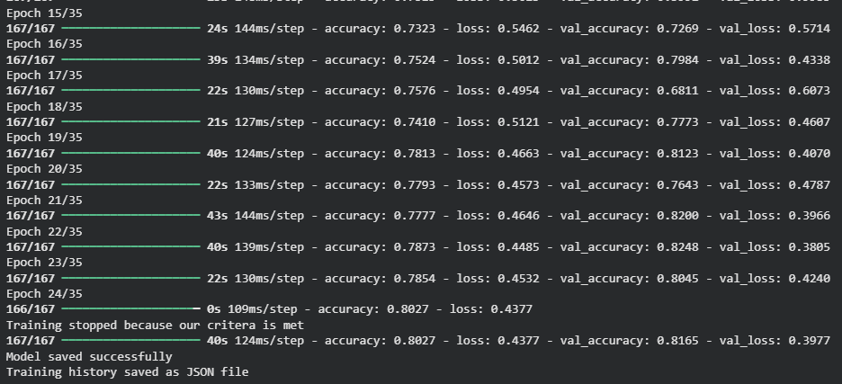
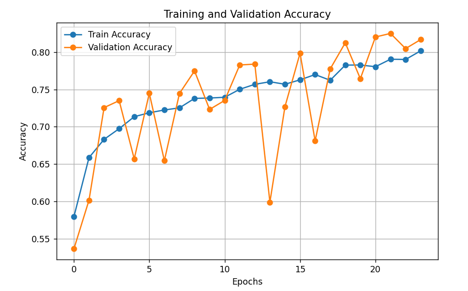
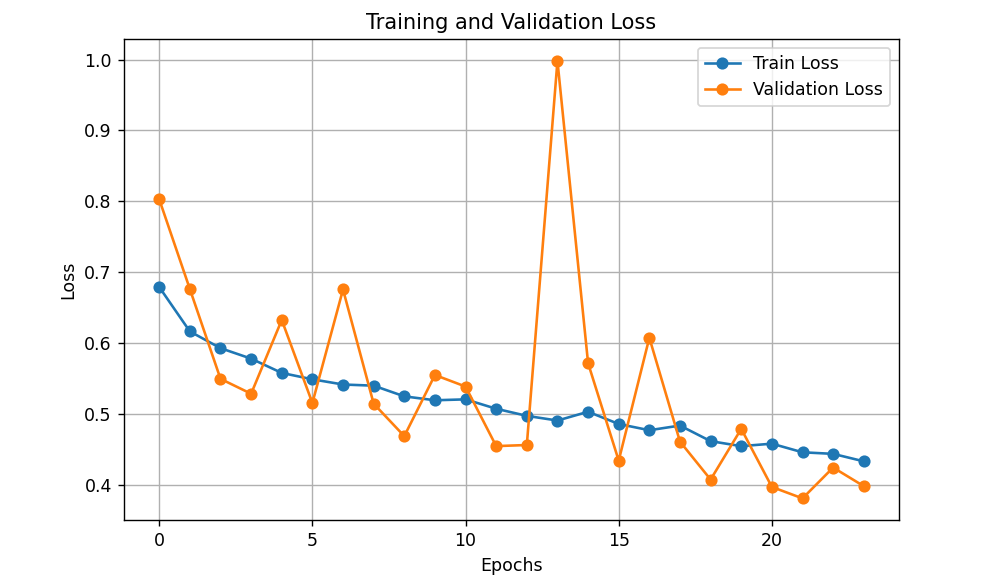

# Cats vs Dogs Binary Classification Model

## Overview
This repository contains a **Convolutional Neural Network (CNN)** model for **binary classification** of cat and dog images.  
The model has been implemented using **TensorFlow** and trained on **25,000 images** sourced from Kaggle.

---

## Dataset
- **Source:** Kaggle `dogs-vs-cats` dataset  
- **Total images:** 25,000 (cats and dogs)  
- **Training dataset:** 21,250 images  
- **Validation dataset:** 3,750 images  
- **Image size:** 120 x 120 pixels  
- **Batch size:** 128  
- **Label mode:** Binary (0 = cat, 1 = dog)

The datasets are prepared using `tf.keras.utils.image_dataset_from_directory` with a **10% validation split**.

---

## Model Architecture
The model has been designed as a **CNN with 3 convolutional layers**:

1. **Input layer:** `(150, 150, 3)`  
2. **Rescaling layer:** Normalizes pixel values to `[0, 1]`  
3. **Convolutional layers + Pooling:**
   - Conv2D 16 filters → MaxPooling2D  
   - Conv2D 32 filters → MaxPooling2D  
   - Conv2D 64 filters → MaxPooling2D  
4. **Flatten layer**  
5. **Dense hidden layer:** 512 neurons, `ReLU` activation  
6. **Output layer:** 1 neuron, `Sigmoid` activation (for binary classification)

**Compiled with:**  
- Optimizer: `Adam`  
- Loss: `Binary Crossentropy`  
- Metrics: `Accuracy`

---

## Training Details
- **Environment:** Google Colab with **T4 GPU**  
- **Epochs:** 35  
- **Early Stopping:** Implemented using custom callback
  - Stops training if **training accuracy ≥ 80%** and **validation accuracy ≥ 80%**  
  - Uses **on_epoch_end** method to monitor metrics  
  - This ensures training stops for demonstration purposes, though the model can potentially perform better  

The training is executed with the following pipeline:

1. Load training and validation datasets  
2. Create and compile the CNN model  
3. Train the model using `model.fit` with early stopping callback  

All code is implemented in **TensorFlow**.

## Training Logs

## Training and Validation Accuracy Graph

## Training and Validation Accuracy Graph

---

## Notes
- The early stopping metric thresholds (`80%`) are chosen for **learning purposes** only.  
- The model is structured to be easy to understand for beginners while demonstrating the full workflow of binary image classification.  
- The repository also uses **Git LFS** for storing large model files (>100MB) efficiently.

---

## References

The dataset used for training and validation is from the Kaggle competition:

[Dogs vs Cats](https://www.kaggle.com/competitions/dogs-vs-cats/data)
- **Framework:** TensorFlow 2.x  
- **GPU Resources:** Colab T4 GPU

[def]: tr